
<h1 align="center">职业高中智慧作业试题系统设计+jsp</h1>

## 简介
职业高中智慧作业试题系统：支持管理员和学生登录，涵盖试题编辑、作业提交与批改管理、考试记录，以及学生和教师管理等功能模块，界面简洁明了，提高教学管理效率。    --计算机毕业设计源码；毕设源码；java毕业设计源码

## 联系方式

<h3 align="center">获取完整代码与数据库文件 + 微信：deepguan QQ: 86050149 QQ群: 783742310</h3>

<h3 align="center">可帮忙远程部署 包运行成功！提供远程部署、修改代码、设计文档指导、代码讲解等服务！</h3>

## 功能介绍（完整见运行截图）
管理员：基本功能包括登录、注册和退出。系统提供多种管理模块，如学生管理、教师管理和班级管理，支持批量操作。管理员可以通过导航菜单访问作业信息管理、试题和试卷管理、考试管理等功能模块。用户界面设计简洁直观，便于信息的查询、添加、修改和删除，增强调度效率。

教师：教师的核心功能包括作业发布与批改、试题与试卷管理以及考试管理。利用系统，教师可以创建、编辑和管理试题，设定题型和分数，并通过上传文件的方式发布作业。批改作业功能允许教师下载学生提交的作业文件，记录批改信息、评语和成绩，使作业批改过程更高效。教师管理模块提供关于教师信息的查询、添加和修改功能，还可以批量删除不再需要的信息。

学生：学生通过系统的登录界面进入个人中心，可以查看课程和考试安排，以及作业提交状态。通过系统提供的作业管理模块，学生可以完成作业并在线提交。作业提交后，学生可查看作业批改情况和成绩反馈。同时，考试管理模块帮助学生了解考试时间、地点和试卷信息，便于复习和考试准备。

系统用户：所有用户可在系统首页访问导航菜单，迅速定位所需功能模块。用户以不同身份登录系统，教师和管理员拥有更多管理权限，而学生则聚焦在学习进度和成绩查询上。通过简洁的界面设计，系统支持用户高效进行信息输入与查询，提升职业高中的教学管理和学习体验。

## 运行截图
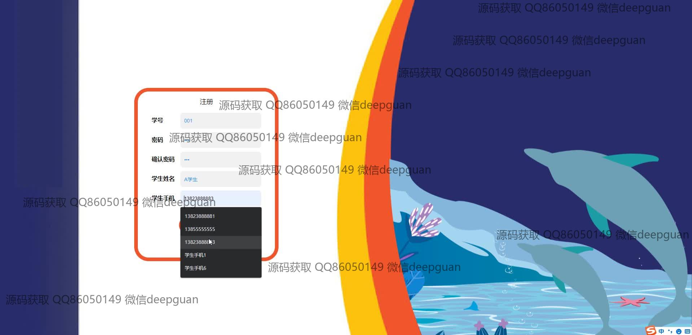
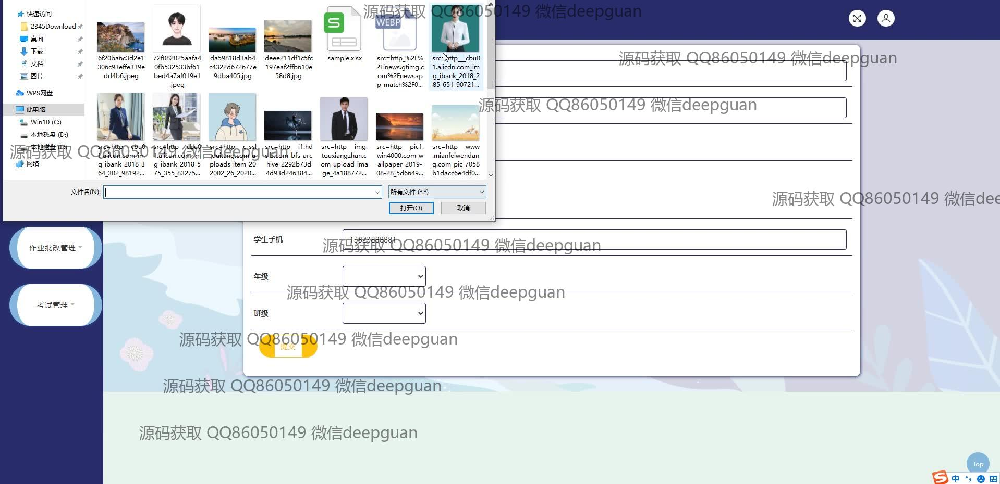
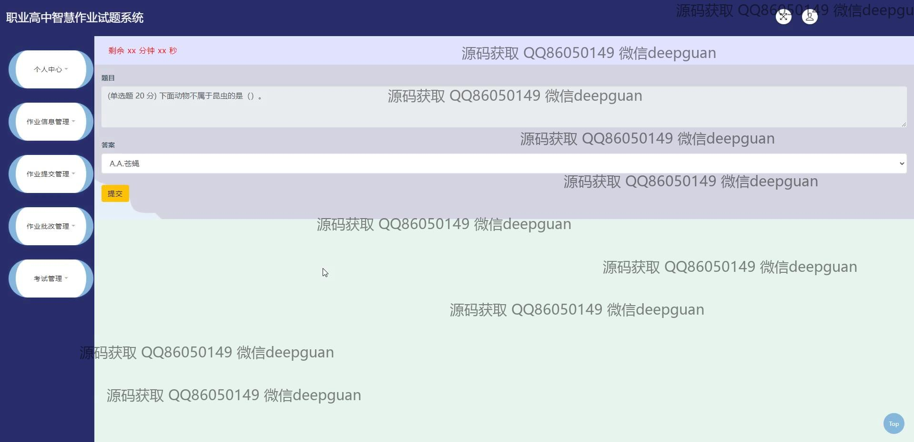
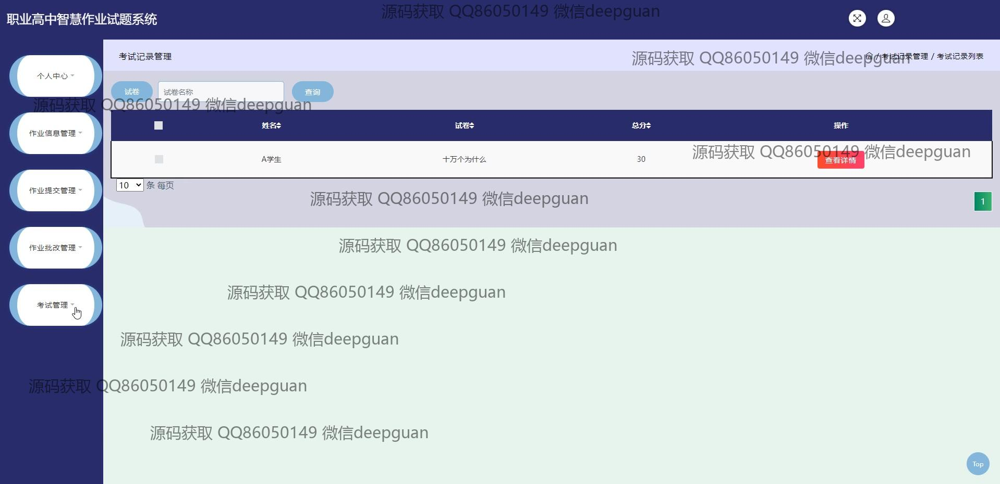
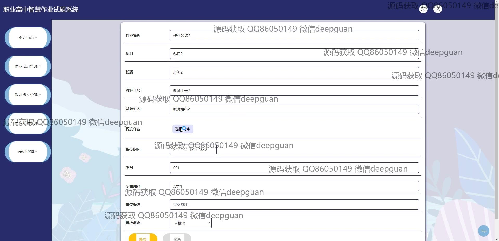
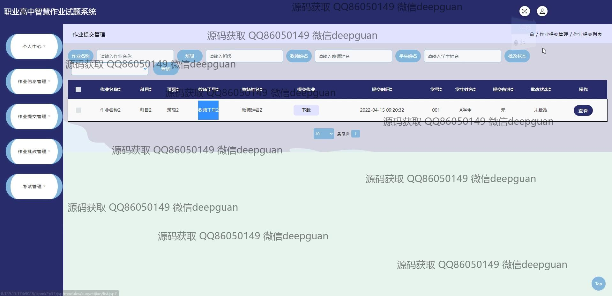
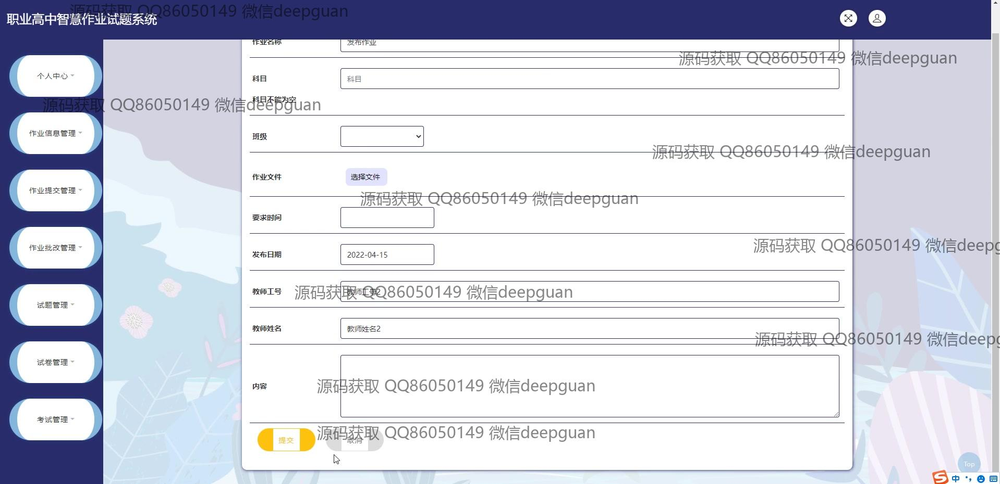
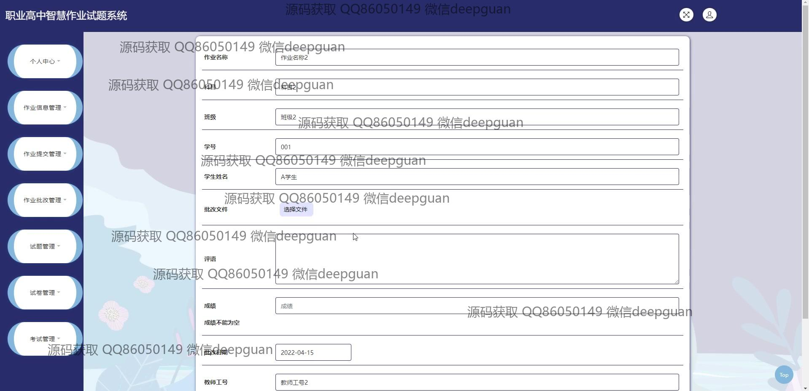
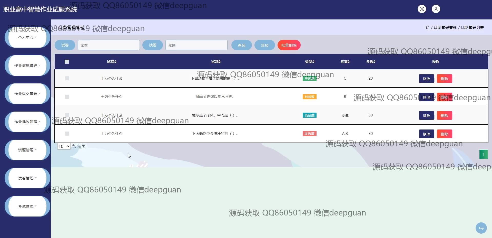
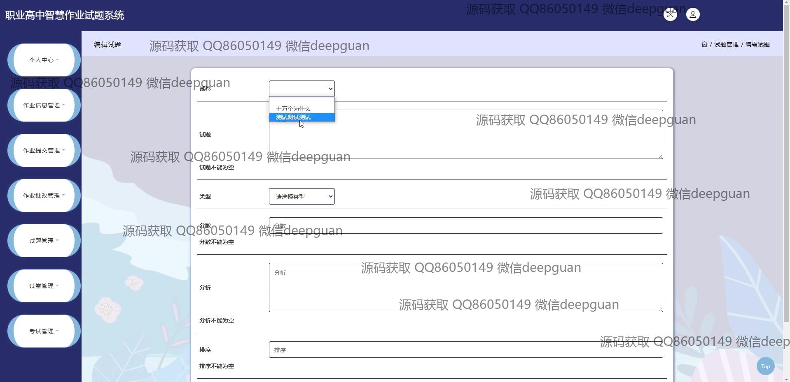
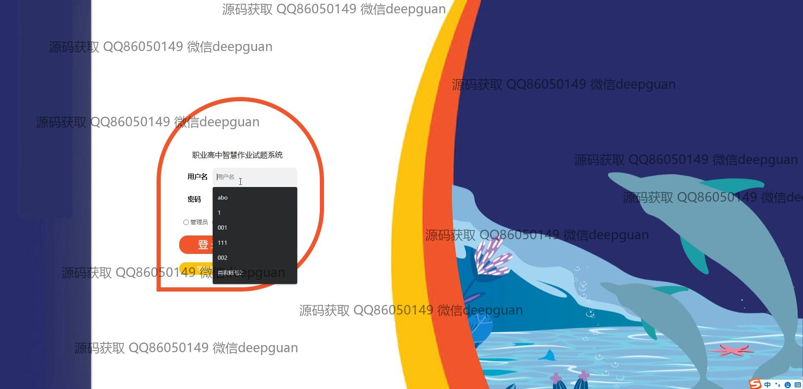

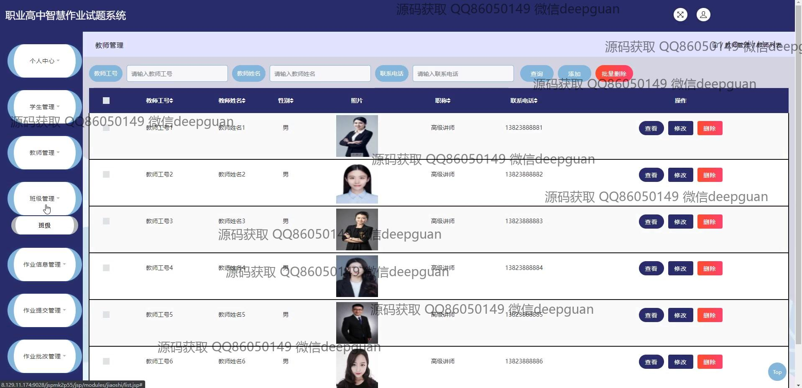
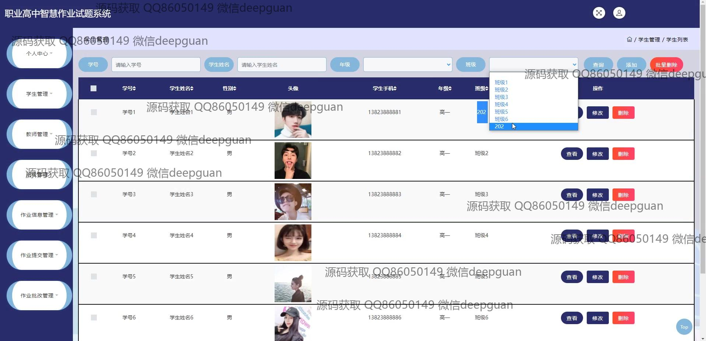

本代码来源于网络,仅供学习参考使用!

